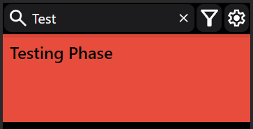

import SwipeActions from '../../static/img/swipe_actions.gif';

The application boasts a range of features aimed at providing users with a comprehensive and user-friendly task
management experience.

### Adding and Editing Entries

A todo-entry encompasses various attributes, with the title being the mandatory field. Other attributes, such as
deadline, estimated duration, and a description, are optional and can be added as needed. The color of an entry
can also be customized. To do this, you can use the dialog that appears when clicking on the color box located above the
description-input, and then select the desired color. Users have the flexibility to edit all attributes
by selecting the entry and clicking on the pencil icon. This way it is easily possible to correct any attributes without
deleting the entry and creating a new one.

### Operations on Entries

Users can efficiently manage todo-entries through deletion or completion actions. Swiping an entry left marks it as
completed, while a right swipe deletes it.

</img>

Users can also click on an entry, which expands the task and reveals additional information about it. Alternatively
to the swipe actions, you can select the checkmark or garbage can icons, which appear on an expanded entry, for
completion or deletion. You can restore the last deleted or completed entry by using the restore button in the settings menu. A new feature to display a [Restore Button](../outlook#restore-button) directly in the entry view after clicking on delete or complete is planned but not implemented yet. Additionally, entries can be edited by selecting the pencil icon.

### Searching

A search bar located at the top of the screen facilitates the search for specific terms within all todo-entries. That
way, even in the Focus Mode, you will be able to find other entries that aren't normally displayed.
Clearing the search can be achieved by clicking the 'x'-button. This will reset the current view back to normal. In the
case of the Focus Mode, the top 5 most crucial tasks will be displayed again.

### Sorting

The app enables users to apply a single sorting criterion at a time. Sorting functionality is available to arrange
entries based on title, deadline, expenditure, or the timestamp of addition / editing. Additionally, sorting can be
configured in
ascending or descending order by clicking the corresponding
symbol: . Per default the entries are sorted by the timestamp
of addition. When sorting by deadline and expenditure entries without any information in these fields will be arranged
last.

