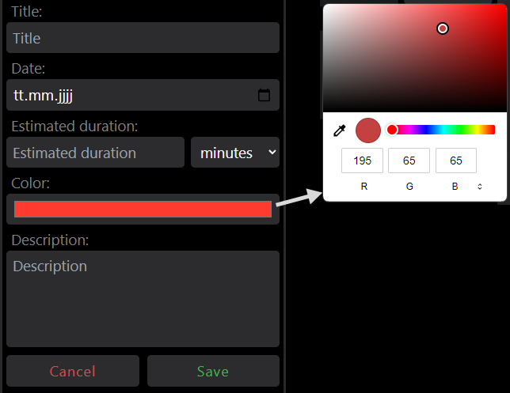
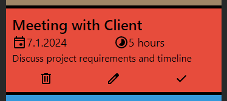
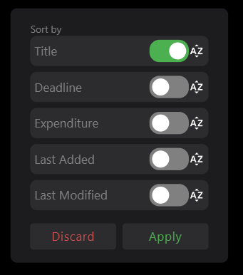

# PBO-Squad-ToDo

ToDo Manager build with VUE

App:
https://fjxhi.github.io/PBO-Squad-ToDo/app

Docs:
https://fjxhi.github.io/PBO-Squad-ToDo/docs

# Instructions for the project:

## Installation

Clone the repository and install the dependencies using:

```sh
git clone https://github.com/FJXHI/PBO-Squad-ToDo.git
cd PBO-Squad-ToDo
npm install
```

Format is not necessary, but recommended:

```sh
npm run format
```

Start the development server locally:

```sh
npm run dev
```

Or open the server to the local network:

```sh
npm run dev -- --host
```

## Documentation

Documentation is written using Docosaurus.
Head to `PBO-Docs\docs` to find the documentation files. Add your own markdown files there and start writing. They will
apperat in the sidebar automatically.
See [Docusaurus Styling and Layout](https://docusaurus.io/docs/styling-layout) for more information.

```sh
cd PBO-Docs
npm install
```

To start the documentation server locally:

```sh
npm start --dev
```

# User Guide

## Introduction

This document serves as a comprehensive guide to the application designed to streamline task management, particularly
tailored for mobile devices.

The ToDo manager app offers a robust platform for users to seamlessly add and customize entries, presenting them in
various display formats for enhanced accessibility.

## Views

The application features two distinct views: the Focus Mode and the Overview Mode. The Overview Mode presents a
grid-layout showcasing all todo-entries, while the Focus Mode prioritizes the display of the top 5 most crucial tasks.


## Functionality

The application boasts a range of features aimed at providing users with a comprehensive and user-friendly task
management experience.

### Adding and Editing Entries

A todo-entry encompasses various attributes, with the title being the mandatory field. Other attributes, such as
deadline, estimated duration, tags, and a description, are optional and can be added as needed. The color of an entry
can also be customized. To do this, you can use the dialog that appears when clicking on the color box located to the
right of the input field for tags, and then select the desired color. Users have the flexibility to edit all attributes
by selecting the entry and clicking on the pencil icon. This way it is easily possible to correct any attributes without
deleting the entry and creating a new one.



### Operations on Entries

Users can efficiently manage todo-entries through deletion or completion actions. Swiping an entry left marks it as
completed, while a right swipe deletes it.


Users can also click on an entry, which expands the task and reveals additional information about it. Alternatively
to the swipe actions, you can select the checkmark or garbage
can icons, which appear on an expanded entry, for completion or deletion. Additionally, entries can be edited by
selecting the pencil icon.



### Searching

A search bar located at the top of the screen facilitates the search for specific terms within all todo-entries. That way
even in the Focus Mode you will be able to find other entries, that aren't normally displayed.
Clearing the search can be achieved by clicking the 'x'-button. This will reset the current view back to normal. In case
of the Focus Mode the top 5 most crucial tasks will be displayed again.


### Sorting

The app enables users to apply a single sorting criterion at a time. Sorting functionality is available to arrange
entries based on title, deadline, expenditure, or the timestamp of addition. Additionally, sorting can be configured in
ascending or descending order.



# VUE

This template should help get you started developing with Vue 3 in Vite.

## Recommended IDE Setup

[VSCode](https://code.visualstudio.com/) + [Volar](https://marketplace.visualstudio.com/items?itemName=Vue.volar) (and
disable
Vetur) + [TypeScript Vue Plugin (Volar)](https://marketplace.visualstudio.com/items?itemName=Vue.vscode-typescript-vue-plugin).

## Type Support for `.vue` Imports in TS

TypeScript cannot handle type information for `.vue` imports by default, so we replace the `tsc` CLI with `vue-tsc` for
type checking. In editors, we
need [TypeScript Vue Plugin (Volar)](https://marketplace.visualstudio.com/items?itemName=Vue.vscode-typescript-vue-plugin)
to make the TypeScript language service aware of `.vue` types.

If the standalone TypeScript plugin doesn't feel fast enough to you, Volar has also implemented
a [Take Over Mode](https://github.com/johnsoncodehk/volar/discussions/471#discussioncomment-1361669) that is more
performant. You can enable it by the following steps:

1. Disable the built-in TypeScript Extension
    1) Run `Extensions: Show Built-in Extensions` from VSCode's command palette
    2) Find `TypeScript and JavaScript Language Features`, right click and select `Disable (Workspace)`
2. Reload the VSCode window by running `Developer: Reload Window` from the command palette.

## Customize configuration

See [Vite Configuration Reference](https://vitejs.dev/config/).

## Project Setup

```sh
npm install
```

### Compile and Hot-Reload for Development

```sh
npm run dev
```

### Type-Check, Compile and Minify for Production

```sh
npm run build
```

### Run Unit Tests with [Vitest](https://vitest.dev/)

```sh
npm run test:unit
```

### Lint with [ESLint](https://eslint.org/)

```sh
npm run lint
```
